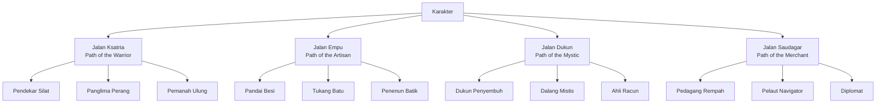

# 🏛️ NUSANTARA: MAJAPAHIT — Game Design Document

> *"Bhinneka Tunggal Ika — Berbeda-beda tetapi tetap satu"*

---

## 1. Overview

| Item | Detail |
|------|--------|
| **Judul** | Nusantara: Majapahit |
| **Genre** | Open World RPG, Sandbox, Action-Adventure |
| **Art Style** | Voxel 3D (terinspirasi Hytale) — semua aset dibuat di **Blockbench** |
| **Engine** | Godot Engine 4.6 (Forward Plus + Jolt Physics) |
| **Platform** | PC (Windows/Linux), potensi Console |
| **Perspektif** | Third-Person |
| **Target Audience** | 13+ (remaja & dewasa, penggemar RPG & sejarah) |
| **Pemain** | Singleplayer (multiplayer co-op sebagai post-launch) |

### Elevator Pitch

Nusantara: Majapahit adalah game RPG open-world bergaya voxel yang mengajak pemain menjalani era keemasan Kerajaan Majapahit (1293–1527 M). Pemain berperan sebagai seorang pemuda Nusantara yang terlibat dalam peristiwa-peristiwa bersejarah — mulai dari pendirian kerajaan oleh Raden Wijaya, Sumpah Palapa Gajah Mada, kejayaan Hayam Wuruk, hingga keruntuhan akhir kerajaan. Dengan dunia voxel yang bisa dieksplorasi, dibangun, dan dihancurkan, pemain mengalami sejarah Indonesia dalam bentuk yang belum pernah ada sebelumnya.

---

## 2. Pilar Desain (Design Pillars)

### 🏛️ Sejarah yang Hidup
Cerita utama mengikuti garis waktu sejarah nyata Majapahit. Setiap quest dan karakter didasarkan pada peristiwa/tokoh historis, tapi dengan kebebasan kreatif untuk membuat narasi yang menarik.

### 🌍 Dunia yang Bernapas
Nusantara terepresentasi sebagai dunia voxel terbuka yang luas — dari hutan tropis Jawa, gunung berapi, pantai eksotis, hingga ibu kota megah Trowulan. NPC menjalani rutinitas harian, pasar beroperasi, dan musim berganti.

### ⚔️ Pertempuran Taktis
Sistem combat yang mendalam terinspirasi seni bela diri Nusantara (Pencak Silat) dengan senjata-senjata tradisional: keris, tombak, pedang, karambit, dan cetbang.

### 🔨 Bangun & Ciptakan
Pemain bisa membangun struktur, crafting senjata & armor, dan merancang permukiman dalam gaya arsitektur Majapahit menggunakan sistem voxel.

### 🎭 Budaya Nusantara
Setiap elemen game — musik, pakaian, makanan, arsitektur — terinspirasi dari budaya Majapahit yang autentik, menjadikan game ini media edukasi budaya.

---

## 3. Gameplay Systems

### 3.1 Eksplorasi Dunia

#### Peta Dunia
Dunia game merupakan representasi voxel dari wilayah kekuasaan Majapahit:

| Zona | Deskripsi | Biome |
|------|-----------|-------|
| **Trowulan** | Ibu kota megah Majapahit, pusat perdagangan & politik | Urban, alun-alun, candi |
| **Hutan Trik** | Hutan di Tarik tempat Raden Wijaya melarikan diri | Hutan tropis lebat |
| **Kediri** | Wilayah musuh awal, bekas kerajaan Jayakatwang | Dataran, sawah |
| **Gunung Semeru** | Gunung suci, dungeon tingkat tinggi | Vulkanik, berbatu |
| **Pesisir Utara** | Pelabuhan perdagangan, jalur sutra maritim | Pantai, pelabuhan |
| **Madura** | Pulau aliansi Arya Wiraraja | Pesisir, pedesaan |
| **Bali** | Pulau budaya Hindu, area lanjutan | Sawah terasering, pura |
| **Kepulauan Rempah** | Maluku, area end-game | Kepulauan, hutan rempah |

#### Fitur Eksplorasi
- **Procedural Voxel Terrain**: Dunia dihasilkan secara prosedural dengan biome yang bervariasi
- **Candi & Dungeon**: Dungeon terinspirasi candi-candi nyata (Panataran, Bajang Ratu, Penataran)
- **Landmark Historis**: Lokasi bersejarah yang bisa ditemukan & dipelajari
- **Sistem Cuaca & Waktu**: Siklus siang-malam, musim hujan & kemarau
- **Fast Travel**: Melalui jaringan pelabuhan dan jalur darat kerajaan
- **Peta Laut**: Pelayaran antar pulau menggunakan perahu jung Majapahit

### 3.2 Sistem Combat

#### Filosofi
Combat menggabungkan aksi real-time yang taktis dengan inspirasi Pencak Silat dan seni perang Nusantara.

#### Tipe Senjata

| Senjata | Tipe | Kecepatan | Jangkauan | Spesial |
|---------|------|-----------|-----------|---------|
| **Keris** | Belati | Cepat | Dekat | Serangan kritis tinggi, efek mistis |
| **Pedang (Klewang)** | Pedang | Sedang | Sedang | Kombo seimbang |
| **Tombak** | Tombak | Sedang | Jauh | Serangan dorong, area |
| **Karambit** | Dual Wield | Sangat Cepat | Sangat Dekat | Sangat agresif, bleeding |
| **Gada** | Pukul | Lambat | Sedang | Damage tinggi, stagger |
| **Busur Bambu** | Ranged | Sedang | Sangat Jauh | Charged shot, headshot |
| **Cetbang** | Meriam | Sangat Lambat | Jauh | Damage area, siege weapon |

#### Mekanik Combat
- **Light & Heavy Attack**: Serangan cepat vs serangan kuat
- **Perfect Block / Parry**: Menangkis serangan tepat waktu untuk riposte
- **Dodge / Dash**: Gerakan menghindar dengan i-frame
- **Stance System**: Kuda-kuda Silat yang berbeda memberikan bonus berbeda
- **Combo Chain**: Rantai serangan yang bisa dikombinasikan
- **Stamina Management**: Setiap aksi menggunakan stamina
- **Elemental/Mystical**: Keris tertentu memiliki kekuatan mistis (api, racun, dll)

#### Musuh

| Kategori | Contoh |
|----------|--------|
| **Manusia** | Prajurit Kediri, Bandit, Bajak Laut |
| **Makhluk Mitos** | Leak, Barong, Rangda, Buto Ijo |
| **Hewan** | Harimau Jawa, Komodo, Buaya, Elang |
| **Boss** | Jayakatwang, Panglima Mongol, Raja Jin |

### 3.3 Crafting & Building

#### Crafting Tiers

```
Tier 1: Pocket Crafting (Inventori)
  → Alat bamboo dasar, obat herbal, obor

Tier 2: Pandai Besi (Anvil Station)
  → Senjata besi, armor dasar

Tier 3: Empu Keris (Master Forge)
  → Keris, senjata pamor, senjata mistis

Tier 4: Arcanist (Dukun's Workshop)
  → Item mistis, jimat, ramuan kuat

Tier 5: Royal Forge (Keraton Workshop)
  → Senjata legendaris, armor kerajaan
```

#### Sistem Building
- **Block Placement**: Penempatan blok voxel secara bebas
- **Material Majapahit**: Bata merah, kayu jati, batu andesit, bambu, ijuk
- **Blueprint System**: Cetak biru arsitektur Majapahit (Candi, Pendopo, Joglo)
- **Struktur Prefab**: Template bangunan tradisional yang bisa dimodifikasi
- **Dekorasi**: Relief, patung, ornamen tradisional Majapahit
- **Sistem Pertanian**: Sawah, ladang rempah, kebun

#### Bahan & Sumber Daya

| Kategori | Contoh |
|----------|--------|
| **Kayu** | Jati, Bambu, Rotan, Cendana |
| **Batu** | Bata merah, Andesit, Granit, Marmer |
| **Logam** | Besi, Perunggu, Emas, Pamor (besi meteor) |
| **Tekstil** | Kapas, Sutra, Batik |
| **Rempah** | Cengkeh, Pala, Lada, Kayu Manis |
| **Herbal** | Jamu ingredients, Racun, Obat |

### 3.4 Sistem RPG

#### Atribut Karakter

| Atribut | Efek |
|---------|------|
| **Kekuatan (Bala)** | Damage fisik, carry capacity |
| **Ketangkasan (Cakra)** | Kecepatan serangan, dodge, crit chance |
| **Ketahanan (Wira)** | HP, stamina, resistensi |
| **Kebijaksanaan (Prajna)** | Damage mistis, crafting quality |
| **Karisma (Wibawa)** | NPC interaction, harga beli/jual, quest |

#### Skill Trees (Jalan / Path)



#### Progression
- **Level System**: Level 1–60 sepanjang storyline
- **Skill Points**: Didapat per level, dialokasikan ke skill tree
- **Reputation System**: Reputasi dengan setiap faksi/wilayah
- **Titel/Gelar**: Gelar kehormatan dari achievements (misal: "Bhayangkara", "Tumenggung")

### 3.5 NPC & Quest System

#### Tipe Quest

| Tipe | Deskripsi |
|------|-----------|
| **Main Quest** | Storyline sejarah utama (wajib) |
| **Side Quest** | Quest sampingan dari NPC di setiap wilayah |
| **Faction Quest** | Quest dari faksi (kerajaan, pedagang, dukun) |
| **Discovery Quest** | Ditemukan saat eksplorasi (prasasti, artefak) |
| **Daily/Recurring** | Quest harian (perdagangan, berburu, bertani) |

#### NPC Behavior
- **Schedule System**: NPC memiliki jadwal harian (tidur, bekerja, ibadah)
- **Relationship System**: Kedekatan dengan NPC mempengaruhi dialog & quest
- **Trading**: Sistem barter & mata uang (keping emas Majapahit)
- **Companion System**: NPC tertentu bisa menjadi teman perjalanan

---

## 4. Visual & Art Direction

### 4.1 Gaya Voxel

- **Tool Pembuatan Aset**: Semua model 3D dibuat di **Blockbench** → export **glTF/GLB** → import Godot
- **Resolusi Voxel**: Blok berukuran sedang (mirip Hytale), detail cukup tinggi
- **Karakter**: Model voxel dengan proporsi semi-realistis (bukan chibi)
- **Lingkungan**: Biome tropis dengan vegetasi lebat, warna hangat
- **Arsitektur**: Bangunan Majapahit dalam voxel — detail relief & ornamen
- **Efek Partikel**: Api, air, debu, mistis glow, cuaca

> 📎 Detail lengkap pipeline aset: [ASSET_PIPELINE.md](file:///e:/majapahit/nusantara-majapahit/docs/ASSET_PIPELINE.md)

### 4.2 Palet Warna

| Elemen | Warna Dominan |
|--------|---------------|
| **Lingkungan** | Hijau tropis, coklat tanah, biru langit |
| **Arsitektur** | Merah bata, emas, coklat kayu jati |
| **UI** | Emas tua, merah tua, hitam, putih gading |
| **Mistis** | Ungu, biru safir, hijau zamrud |
| **Combat VFX** | Oranye api, putih kilat, merah darah |

### 4.3 Audio & Musik

#### Musik
- **Gamelan Jawa** sebagai instrumen utama soundtrack
- **Ambient Sound**: Suara alam tropis (burung, sungai, angin sawah)
- **Combat Music**: Gamelan intensif + perkusi perang
- **Kota/Pasar**: Gamelan lembut + suara keramaian

#### Sound Effects
- **Senjata**: Suara logam keris, desing panah bambu
- **Lingkungan**: Angin tropis, hujan deras, gunung berapi
- **UI**: Suara gamelan untuk notifikasi

---

## 5. Technical Overview

### 5.1 Arsitektur Teknis

```
Godot 4.6 (Forward Plus Renderer)
├── Voxel Engine (custom)
│   ├── Chunk System (16x16x16)
│   ├── Mesh Generation (Greedy Meshing)
│   ├── LOD System (Level of Detail)
│   └── Procedural Generation
├── Physics (Jolt Physics)
│   ├── Character Controller
│   ├── Ragdoll System
│   └── Voxel Collision
├── AI System
│   ├── NPC Behavior Trees
│   ├── Pathfinding (A* on voxel grid)
│   └── Combat AI (State Machine)
├── Rendering
│   ├── Voxel Rendering Pipeline
│   ├── Dynamic Lighting & Shadows
│   ├── Weather System
│   └── Particle Effects
└── Game Systems
    ├── Quest Manager
    ├── Inventory & Crafting
    ├── Save/Load System
    └── Dialog System
```

### 5.2 Performa Target

| Spec | Detail |
|------|--------|
| **Minimum** | GTX 1050 / RX 560, 8 GB RAM, i5-6400 |
| **Recommended** | GTX 1660 / RX 5600 XT, 16 GB RAM, i7-8700 |
| **FPS Target** | 60 FPS pada setting Medium |
| **Render Distance** | 12–24 chunks (adjustable) |
| **World Size** | ~16 km² explorable area |

### 5.3 Struktur Proyek Godot

```
nusantara-majapahit/
├── project.godot
├── assets/
│   ├── textures/          # Tekstur voxel & UI
│   ├── models/            # Model 3D karakter & props
│   ├── audio/             # Musik & SFX
│   ├── fonts/             # Font game
│   └── shaders/           # Custom shaders
├── scenes/
│   ├── world/             # Scene dunia & chunk
│   ├── characters/        # Scene karakter
│   ├── ui/                # Scene UI
│   ├── vfx/               # Visual effects
│   └── levels/            # Dungeon & area khusus
├── scripts/
│   ├── core/              # Sistem inti (voxel, chunk, dll)
│   ├── player/            # Player controller & systems
│   ├── npc/               # AI & NPC behavior
│   ├── combat/            # Sistem pertarungan
│   ├── crafting/          # Crafting & building
│   ├── quest/             # Quest system
│   ├── ui/                # UI controller
│   ├── world_gen/         # Procedural world generation
│   └── utils/             # Utilitas & helper
├── data/
│   ├── items/             # Item database (JSON/Resource)
│   ├── quests/            # Quest definitions
│   ├── dialogs/           # Dialog trees
│   ├── recipes/           # Crafting recipes
│   └── lore/              # Lore entries
├── addons/                # Plugin & addon
└── docs/                  # Dokumentasi (file ini)
```

---

## 6. Monetisasi & Release

### Model Bisnis
- **Premium**: Pembelian satu kali (one-time purchase)
- **DLC**: Ekspansi cerita (era Demak, Singasari, Sriwijaya)
- **Cosmetic**: Skin pakaian adat daerah (opsional, bukan pay-to-win)

### Roadmap Pengembangan

| Fase | Durasi | Milestone |
|------|--------|-----------|
| **Pre-Alpha** | 6 bulan | Voxel engine, basic movement, 1 zona |
| **Alpha** | 6 bulan | Combat system, 3 zona, main quest Act 1 |
| **Beta** | 6 bulan | Semua zona, crafting, side quests |
| **Release** | 3 bulan | Polish, optimization, full story |
| **Post-Launch** | Ongoing | DLC, multiplayer, mod support |

---

## 7. Unique Selling Points (USP)

1. **Game voxel RPG pertama berlatar Majapahit** — belum ada game sejenis
2. **Sejarah Indonesia yang playable** — belajar sejarah sambil bermain
3. **Budaya autentik** — gamelan, batik, keris, candi, makanan tradisional
4. **Voxel sandbox + RPG naratif** — gabungan antara kebebasan Hytale dan kedalaman cerita RPG
5. **Seni perang Nusantara** — Pencak Silat dan senjata tradisional sebagai combat system
6. **Dunia tropis yang unik** — setting Nusantara yang jarang dieksplorasi di game

---

*Dokumen ini akan terus diperbarui seiring perkembangan proyek.*
