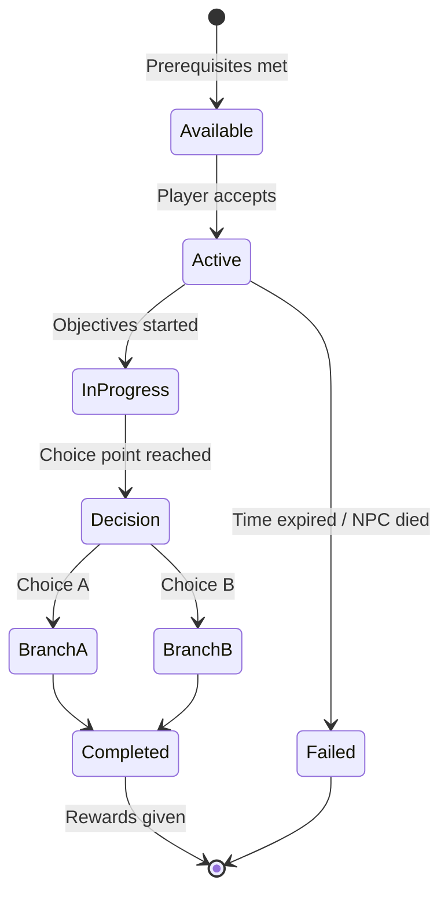

# ⚙️ NUSANTARA: MAJAPAHIT — Technical Design Document

> *Panduan Teknis Pengembangan dengan Godot Engine 4.6*

---

## 1. Teknologi & Engine

| Komponen | Teknologi |
|----------|-----------|
| **Game Engine** | Godot 4.6 |
| **Renderer** | Forward Plus (Vulkan/D3D12) |
| **Physics** | Jolt Physics |
| **3D Modeling** | Blockbench (semua aset 3D) → Export glTF/GLB |
| **Scripting** | GDScript (utama), C++ via GDExtension (performa kritis) |
| **Data Format** | Godot Resource (.tres/.res), JSON untuk data statis |
| **Version Control** | Git + Git LFS (untuk asset besar) |

> 📎 Lihat [ASSET_PIPELINE.md](file:///e:/majapahit/nusantara-majapahit/docs/ASSET_PIPELINE.md) untuk panduan lengkap pembuatan aset dengan Blockbench.

---

## 2. Voxel Engine Architecture

### 2.1 Chunk System

```
World
├── Region (16x16 chunks) — streaming unit
│   └── Chunk (16x16x256 voxels) — mesh unit  
│       └── Section (16x16x16 voxels) — render unit
│           └── Voxel (1 unit) — data unit
```

#### Voxel Data Structure
```gdscript
# Setiap voxel disimpan sebagai 16-bit integer
# Bit layout:
# [15-8] Block ID (256 tipe blok)
# [7-4]  Block State (16 variasi: rotasi, bentuk)  
# [3-0]  Light Level (16 level cahaya)
```

#### Chunk Manager
```gdscript
class_name ChunkManager extends Node3D

var loaded_chunks: Dictionary = {}  # Vector2i -> Chunk
var chunk_load_radius: int = 8
var chunk_unload_radius: int = 12

func _process(delta: float) -> void:
    var player_chunk = world_to_chunk(player.global_position)
    _load_nearby_chunks(player_chunk)
    _unload_distant_chunks(player_chunk)

func _load_nearby_chunks(center: Vector2i) -> void:
    # Spiral loading pattern untuk prioritas chunk terdekat
    for offset in spiral_offsets:
        var coord = center + offset
        if coord not in loaded_chunks:
            _request_chunk_load(coord)
```

### 2.2 Mesh Generation

Menggunakan **Greedy Meshing** untuk mengurangi jumlah poligon:

```
Proses Meshing:
1. Iterate setiap face di section (16³)
2. Cek apakah face terekspos (neighbor = air/transparent)
3. Gabungkan face yang sama bersebelahan (greedy merge)
4. Generate vertex, UV, normal
5. Upload ke GPU via SurfaceTool / ArrayMesh
```

#### LOD Strategy

| LOD Level | Jarak | Detail |
|-----------|-------|--------|
| LOD 0 | 0–4 chunks | Full detail, semua face |
| LOD 1 | 4–8 chunks | Reduced mesh, skip small details |
| LOD 2 | 8–16 chunks | Billboard/imposter untuk struktur besar |
| LOD 3 | 16+ chunks | Heightmap silhouette saja |

### 2.3 World Generation Pipeline

```
Seed → Noise Layers → Biome Map → Height Map → Block Placement → Structure Gen → Decoration
```

#### Noise Layers
```gdscript
var continent_noise: FastNoiseLite  # Skala besar, bentuklahan
var terrain_noise: FastNoiseLite    # Detail terrain
var cave_noise: FastNoiseLite       # Gua & terowongan  
var biome_noise: FastNoiseLite      # Temperature & moisture
var river_noise: FastNoiseLite      # Sungai & danau
```

#### Biome Selection
```
Temperature ↕
Hot    │ Pantai    │ Hutan Tropis │ Savana    │
Warm   │ Sawah     │ Hutan Jati   │ Dataran   │  
Cool   │ Rawa      │ Hutan Pinus  │ Pegunungan│
Cold   │ Puncak Gunung                        │
       └──────────────────────────────────────── Moisture →
         Kering     Sedang        Basah
```

---

## 3. Core Systems Architecture

### 3.1 Scene Tree Structure

```
Main (Node)
├── World (Node3D)
│   ├── ChunkManager
│   ├── WeatherSystem
│   ├── DayNightCycle
│   └── EntityManager
├── Player (CharacterBody3D)
│   ├── Camera3D
│   ├── CombatSystem
│   ├── InventorySystem
│   ├── InteractionSystem
│   └── PlayerModel
├── NPCManager (Node)
│   └── [NPC instances...]
├── QuestManager (Node)
├── DialogManager (Node)
├── CraftingManager (Node)
└── UI (CanvasLayer)
    ├── HUD
    ├── InventoryUI
    ├── DialogUI
    ├── MapUI
    ├── QuestLogUI
    └── PauseMenu
```

### 3.2 Autoload Singletons

```gdscript
# project.godot autoloads
GameManager     # State game global, save/load
EventBus        # Signal bus untuk decoupled communication
AudioManager    # Musik & SFX manager
DataManager     # Load item/quest/recipe database
SettingsManager # Player settings & preferences
```

### 3.3 Event Bus Pattern

```gdscript
# event_bus.gd
class_name EventBusClass extends Node

signal player_damaged(amount: float, source: Node)
signal item_collected(item_id: String, amount: int)
signal quest_updated(quest_id: String, status: String)
signal chunk_loaded(chunk_coord: Vector2i)
signal day_changed(day: int, season: String)
signal npc_relationship_changed(npc_id: String, value: int)
signal combat_started(enemies: Array[Node3D])
signal combat_ended(result: String)
```

---

## 4. Player Systems

### 4.1 Character Controller

```gdscript
class_name PlayerController extends CharacterBody3D

@export var move_speed: float = 5.0
@export var sprint_speed: float = 8.0
@export var jump_force: float = 8.0
@export var gravity: float = 20.0

enum State { IDLE, WALKING, SPRINTING, JUMPING, FALLING, 
             ATTACKING, BLOCKING, DODGING, INTERACTING,
             SWIMMING, CLIMBING }

var current_state: State = State.IDLE
var stamina: float = 100.0
var max_stamina: float = 100.0
```

### 4.2 Combat System

```gdscript
class_name CombatSystem extends Node

# State Machine untuk combat
enum CombatState { IDLE, LIGHT_ATTACK, HEAVY_ATTACK, 
                   BLOCKING, PARRYING, DODGING, STAGGERED,
                   COMBO_CHAIN, STANCE_SWITCH }

var current_combo: int = 0
var max_combo: int = 4
var current_stance: StanceData
var equipped_weapon: WeaponData

# Damage calculation
func calculate_damage(base: float, weapon: WeaponData, 
                       target: Node3D) -> float:
    var damage = base * weapon.damage_multiplier
    damage *= stance_bonus(current_stance)
    damage *= combo_multiplier(current_combo)
    if is_critical():
        damage *= 2.0
    damage -= get_target_defense(target)
    return max(1.0, damage)
```

### 4.3 Inventory System

```gdscript
class_name InventorySystem extends Node

var slots: Array[ItemStack] = []
var max_slots: int = 36
var equipment_slots: Dictionary = {
    "head": null,      # Mahkota, Topi
    "chest": null,     # Baju besi, Baju batik
    "legs": null,      # Celana, Kain jarik
    "feet": null,      # Alas kaki
    "main_hand": null, # Senjata utama
    "off_hand": null,  # Perisai, Keris kecil
    "accessory_1": null, # Jimat, Gelang
    "accessory_2": null  # Kalung, Cincin
}

class ItemStack:
    var item_id: String
    var amount: int
    var max_stack: int
    var metadata: Dictionary  # Durability, enchant, dll
```

---

## 5. NPC & AI Systems

### 5.1 Behavior Tree Structure

```
NPC Root
├── Selector: Main Behavior
│   ├── Sequence: Combat
│   │   ├── Condition: Is Hostile & Player in Range
│   │   ├── Action: Calculate Attack Strategy
│   │   └── Action: Execute Attack Pattern
│   ├── Sequence: Flee
│   │   ├── Condition: HP < 20%
│   │   └── Action: Run Away
│   ├── Sequence: Schedule
│   │   ├── Condition: Is Schedule Time
│   │   └── Action: Go To Schedule Location
│   └── Sequence: Idle
│       └── Action: Wander / Rest / Socialize
```

### 5.2 NPC Schedule System

```gdscript
class_name NPCSchedule extends Resource

@export var daily_schedule: Array[ScheduleEntry] = []

class ScheduleEntry:
    var time_start: float  # 0.0 - 24.0
    var time_end: float
    var location: String   # Node path atau marker name
    var activity: String   # "work", "eat", "sleep", "pray", "trade"
    var animation: String  # Animasi yang dimainkan

# Contoh jadwal Pandai Besi:
# 06:00 - Bangun, pergi ke tungku
# 07:00 - Menempa besi
# 12:00 - Makan siang di warung
# 13:00 - Kembali menempa
# 17:00 - Bersembahyang di candi
# 19:00 - Makan malam di rumah
# 21:00 - Tidur
```

### 5.3 Pathfinding

```
Navmesh-based untuk area terbuka
+ A* grid pathfinding untuk voxel terrain
+ Jump Point Search untuk optimasi long-distance
```

---

## 6. Quest System

### 6.1 Quest Data Structure

```gdscript
class_name QuestData extends Resource

@export var quest_id: String
@export var title: String
@export var description: String
@export var quest_type: QuestType  # MAIN, SIDE, FACTION, DISCOVERY
@export var act: int  # 1-5

@export var prerequisites: Array[String]  # Quest IDs yang harus selesai
@export var objectives: Array[QuestObjective]
@export var rewards: Array[QuestReward]
@export var choices: Array[QuestChoice]  # Untuk moral dilemma

@export var dialog_start: String  # Dialog tree ID
@export var dialog_complete: String
@export var location_markers: Array[String]

enum QuestType { MAIN, SIDE, FACTION, DISCOVERY, DAILY }
```

### 6.2 Quest Flow



---

## 7. Save System

### 7.1 Save Data Structure

```gdscript
var save_data: Dictionary = {
    "version": "1.0",
    "timestamp": "",
    "player": {
        "position": Vector3.ZERO,
        "stats": {},
        "inventory": [],
        "equipment": {},
        "skills": {},
        "generation": 1
    },
    "world": {
        "modified_chunks": {},  # Hanya simpan chunk yang diubah pemain
        "time_of_day": 0.0,
        "current_day": 0,
        "current_season": ""
    },
    "quests": {
        "active": [],
        "completed": [],
        "failed": [],
        "choices_made": {}
    },
    "npcs": {
        "relationships": {},
        "alive_status": {},
        "positions": {}
    },
    "factions": {
        "reputation": {}
    }
}
```

### 7.2 Save Strategy
- **Auto-save**: Setiap 5 menit dan saat memasuki area baru
- **Manual save**: Di titik simpan (prasasti batu)
- **Chunk delta**: Hanya simpan perubahan dari world generation default
- **Compression**: Gunakan Godot built-in compression (ZSTD)

---

## 8. Rendering Pipeline

### 8.1 Voxel Shader

```glsl
// Voxel terrain shader (simplified)
shader_type spatial;

uniform sampler2DArray texture_atlas : source_color;
uniform float ambient_occlusion_strength = 0.3;

varying flat uint v_block_id;
varying float v_ao;

void fragment() {
    vec3 base_color = texture(texture_atlas, 
        vec3(UV, float(v_block_id))).rgb;
    
    // Ambient Occlusion
    float ao = mix(1.0, v_ao, ambient_occlusion_strength);
    
    ALBEDO = base_color * ao;
    ROUGHNESS = 0.8;
    METALLIC = 0.0;
}
```

### 8.2 Day/Night Cycle

```gdscript
class_name DayNightCycle extends Node3D

@export var day_duration_minutes: float = 20.0  # Real-time
@export var sun: DirectionalLight3D
@export var moon: DirectionalLight3D
@export var sky: WorldEnvironment

var time_of_day: float = 0.5  # 0.0 = midnight, 0.5 = noon

func _process(delta: float) -> void:
    time_of_day += delta / (day_duration_minutes * 60.0)
    time_of_day = fmod(time_of_day, 1.0)
    
    # Rotate sun
    sun.rotation.x = lerp_angle(-PI/2, 3*PI/2, time_of_day)
    
    # Adjust light color & intensity
    var sun_intensity = clamp(sin(time_of_day * TAU), 0.0, 1.0)
    sun.light_energy = sun_intensity
    moon.light_energy = 1.0 - sun_intensity
    
    # Sky color transition
    _update_sky_colors(time_of_day)
```

### 8.3 Weather System

```gdscript
class_name WeatherSystem extends Node3D

enum WeatherType { CLEAR, CLOUDY, RAIN, STORM, FOG, 
                   VOLCANIC_ASH }

var current_weather: WeatherType = WeatherType.CLEAR
var transition_time: float = 30.0  # Seconds untuk transisi

# Cuaca mempengaruhi gameplay:
# - Rain: Visibility berkurang, api padam, tanaman tumbuh cepat
# - Storm: Damage di outdoor, petir bisa membakar
# - Fog: Stealth bonus, visibility minimal
# - Volcanic Ash: Damage over time, khusus area gunung
```

---

## 9. Performance Optimization

### 9.1 Threading Strategy

| Thread | Tugas |
|--------|-------|
| **Main Thread** | Rendering, input, UI |
| **Thread Pool 1** | Chunk mesh generation |
| **Thread Pool 2** | World generation (noise sampling) |
| **Thread Pool 3** | AI pathfinding & behavior |
| **Thread Pool 4** | Save/Load operations |

### 9.2 Memory Budget

| Komponen | Budget |
|----------|--------|
| **Voxel Data** | ~2 GB (loaded chunks) |
| **Mesh Data** | ~512 MB |
| **Textures** | ~512 MB |
| **Audio** | ~256 MB |
| **NPC & Entities** | ~256 MB |
| **UI & Misc** | ~256 MB |
| **Total Target** | < 4 GB RAM |

### 9.3 Optimization Techniques
1. **Object Pooling**: Untuk partikel, projectile, item drops
2. **Frustum Culling**: Hanya render chunk yang terlihat kamera
3. **Occlusion Culling**: Skip chunk yang terhalang chunk lain
4. **Instanced Rendering**: Untuk vegetasi, dekorasi berulang
5. **Texture Atlas**: Semua voxel texture dalam satu atlas
6. **Async Loading**: Chunk loading di background thread
7. **Delta Compression**: Save file hanya menyimpan perubahan

---

## 10. Development Milestones

### Phase 1: Foundation (Bulan 1–3)
- [ ] Voxel chunk system (generate, mesh, render)
- [ ] Basic player controller (movement, camera)
- [ ] Simple world generation (flat + noise terrain)
- [ ] Block placement & destruction
- [ ] Basic UI framework

### Phase 2: Core Systems (Bulan 4–6)
- [ ] Combat system prototype
- [ ] Inventory & equipment
- [ ] NPC system dasar (spawn, walk, dialog)
- [ ] Day/night cycle
- [ ] Biome system

### Phase 3: Content Pipeline (Bulan 7–9)
- [ ] Crafting system
- [ ] Quest system framework
- [ ] Dialog system
- [ ] Building system (blueprints)
- [ ] Audio integration (gamelan)

### Phase 4: World Building (Bulan 10–12)
- [ ] Trowulan city generation
- [ ] Multiple biomes & zones
- [ ] Dungeon generation
- [ ] NPC schedules & AI
- [ ] Main quest Act 1

### Phase 5: Polish (Bulan 13–15)
- [ ] Weather system
- [ ] Particle effects
- [ ] LOD system & optimization
- [ ] Save/load system
- [ ] Remaining main quest acts

### Phase 6: Beta & Release (Bulan 16–18)
- [ ] Beta testing
- [ ] Performance profiling
- [ ] Bug fixing
- [ ] Localization (ID/EN)
- [ ] Release preparation

---

*Dokumen teknis ini akan terus diperbarui seiring perkembangan arsitektur sistem.*
